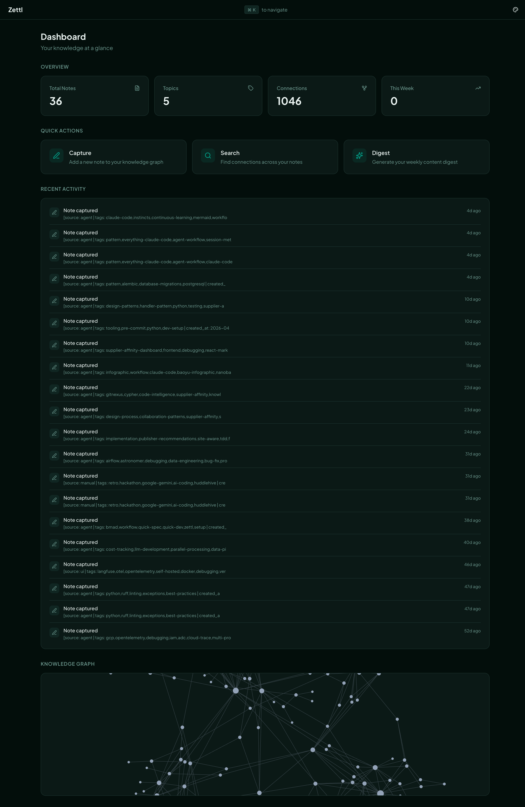
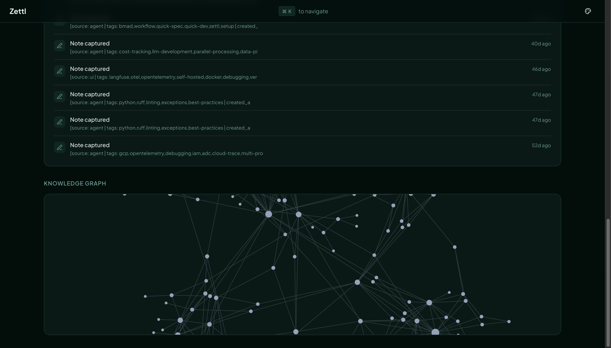
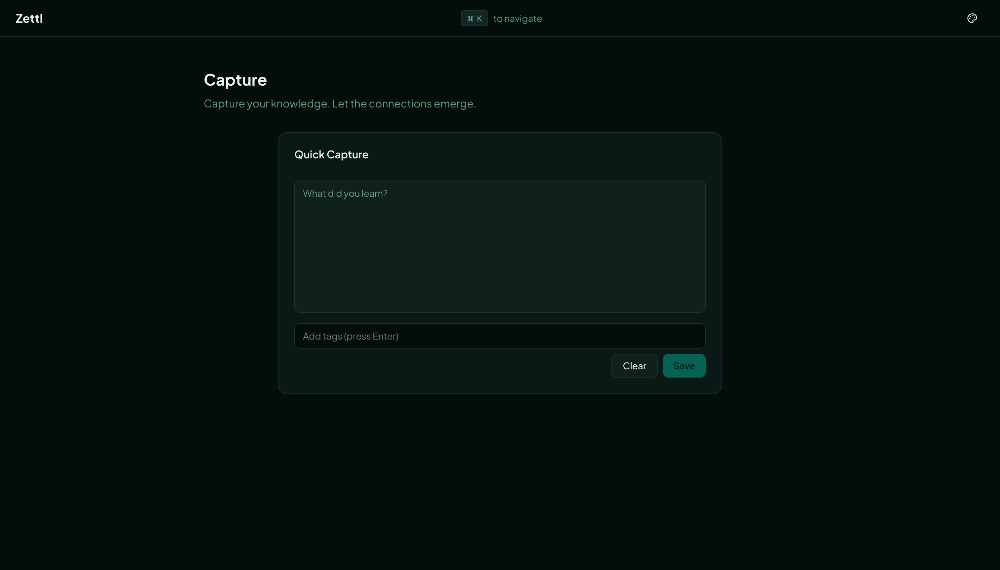
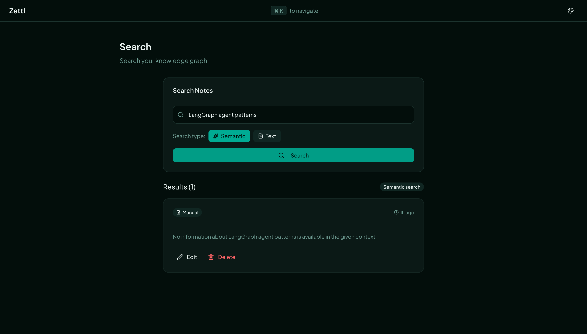
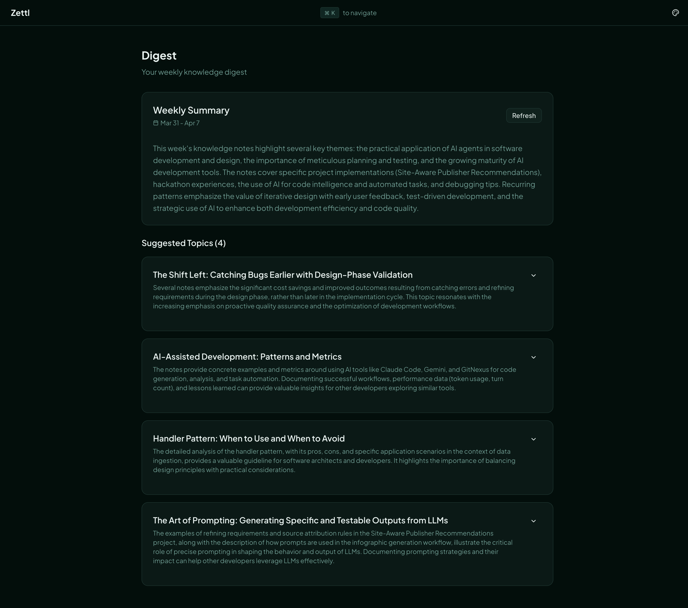
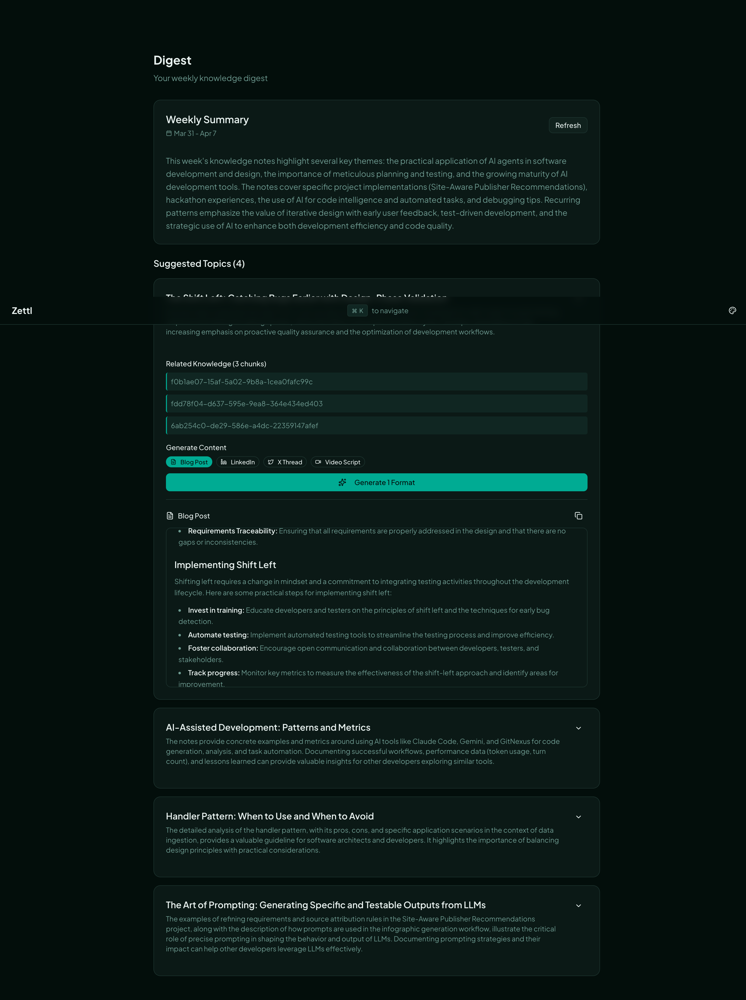
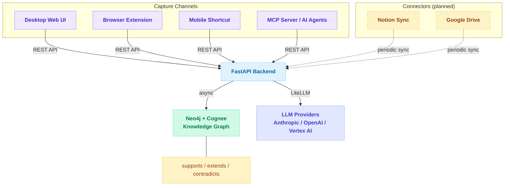

# Zettl

> Turn your daily learnings into a living knowledge graph — then let AI draft your next blog post, LinkedIn update, or video script.

Zettl is an open-source personal knowledge management system. Capture notes from anywhere (web, browser extension, mobile shortcut, or AI agents via MCP), store them in a Neo4j graph database with Zettelkasten-style auto-linking via [Cognee](https://github.com/topoteretes/cognee), and generate weekly content digests in multiple formats using a LangGraph agent.

---

## Screenshots

### Dashboard
The keyboard-first dashboard shows your knowledge graph, live stats, quick actions, and recent activity at a glance. Navigate everything with `Cmd+K`.



### Knowledge Graph
An interactive force-directed graph of your notes and the semantic connections between them. Click any node to explore.



### Note Capture
Add notes with tags and source tracking. Notes are immediately processed into the graph — semantic connections form automatically.



### Semantic Search
Full-text and graph-completion search across everything you've captured.



### Weekly Digest
Each week, Zettl generates a narrative summary of your learnings and suggests topics worth writing about.



### Content Generation
Select a topic from your digest, pick formats, and the LangGraph content agent drafts content tailored to each platform — rendered as markdown with Mermaid diagram support.



---

## Features

| Feature | Status |
|---------|--------|
| Note capture (web UI, browser extension, mobile, MCP) | ✅ |
| Semantic knowledge graph (Neo4j + Cognee) | ✅ |
| Semantic search (`graph_completion` + `chunks`) | ✅ |
| Interactive graph visualization | ✅ |
| Weekly digest with topic suggestions | ✅ |
| Content generation — blog, LinkedIn, X thread, video script | ✅ |
| LangGraph content agent with pluggable skill files | ✅ |
| Claude Code MCP server | ✅ |
| Weekly digest caching | ✅ |
| Note edit / delete | ✅ |
| Markdown + Mermaid rendering in digest output | ✅ |
| Activity feed | ✅ |
| Browser extension (Chrome) | 🔜 Planned |
| Notion / Google Drive connectors | 🔜 Planned |
| User authentication + multi-tenancy | 🔜 Planned |

---

## How It Works



### Content Agent

Content generation is powered by a LangGraph `StateGraph` agent. Instead of hardcoded prompts, the agent loads **skill files** — plain Markdown files that define the writing instructions for each content format.

```
content_agent/
├── graph.py          # LangGraph StateGraph (agent ↔ tools loop)
├── state.py          # Typed state (topic, chunks, formats, messages)
├── tools.py          # list_skills, load_skill, search_knowledge
└── skills/
    ├── write-blog-post.md
    ├── write-linkedin-post.md
    ├── write-x-thread.md
    └── write-video-script.md
```

To add a new content format: drop a `.md` file in `skills/` and add the format to the `ContentFormat` enum. No Python changes required.

---

## Quick Start

### With Docker (recommended)

```bash
git clone https://github.com/your-username/zettl.git
cd zettl/zettl
cp .env.example .env        # Fill in your API keys (see Configuration)
docker-compose up --build
```

| Service | URL |
|---------|-----|
| Web UI | http://localhost:3000 |
| API | http://localhost:8000 |
| API docs | http://localhost:8000/docs |
| Neo4j Browser | http://localhost:7474 |

### Without Docker

**API:**
```bash
cd zettl/api
uv venv && source .venv/bin/activate
uv pip install -e ".[dev]"
uvicorn app.main:app --reload --port 8000
```

**UI:**
```bash
cd zettl/ui
npm install
npm run dev        # http://localhost:3000
```

**Neo4j:** Run locally or use [Neo4j Aura](https://neo4j.com/cloud/platform/aura-graph-database/) (free tier available).

---

## Configuration

Copy `zettl/.env.example` to `zettl/.env` and set:

<!-- AUTO-GENERATED from zettl/.env.example -->
```env
# Neo4j (direct driver connection)
NEO4J_URI=bolt://localhost:7687
NEO4J_USER=neo4j
NEO4J_PASSWORD=your-password

# Cognee graph DB config (mirrors Neo4j values above)
GRAPH_DATABASE_PROVIDER=neo4j
GRAPH_DATABASE_URL=bolt://localhost:7687
GRAPH_DATABASE_USERNAME=neo4j
GRAPH_DATABASE_PASSWORD=your-password

# LLM — choose one provider
LLM_PROVIDER=anthropic           # anthropic | openai | vertex_ai
LLM_MODEL=claude-sonnet-4-20250514

# Anthropic
ANTHROPIC_API_KEY=sk-ant-...

# OpenAI (if using openai provider)
# OPENAI_API_KEY=sk-...

# Google Vertex AI (if using vertex_ai provider)
# LLM_PROVIDER=vertex_ai
# LLM_MODEL=gemini-1.5-pro
# VERTEX_PROJECT=your-gcp-project
# VERTEX_LOCATION=us-central1
```
<!-- END AUTO-GENERATED -->

---

## MCP Server

Zettl ships an [MCP server](zettl/mcp-server/) so Claude Code and other MCP-compatible AI tools can capture notes, search the knowledge graph, and generate content directly.

```bash
cd zettl/mcp-server
uv pip install -e ".[dev]"
```

Add to your `~/.claude/claude_desktop_config.json`:

```json
{
  "mcpServers": {
    "zettl": {
      "command": "uvx",
      "args": ["--from", "/path/to/zettl/mcp-server", "zettl-mcp"],
      "env": { "ZETTL_API_URL": "http://localhost:8000" }
    }
  }
}
```

Available tools: `add_note`, `search_knowledge`, `generate_digest`, `generate_content`.

---

## Architecture

```
zettl/
├── api/                        # FastAPI backend
│   ├── app/
│   │   ├── main.py             # App entrypoint, Cognee config, CORS
│   │   ├── config.py           # Pydantic settings from .env
│   │   ├── routers/            # notes.py, digest.py, stats.py
│   │   ├── services/
│   │   │   ├── cognee_service.py       # Knowledge graph ops
│   │   │   ├── llm_service.py          # LiteLLM wrapper
│   │   │   ├── digest_cache_service.py # Weekly digest cache (Neo4j)
│   │   │   ├── stats_service.py        # Dashboard KPI queries
│   │   │   └── content_agent/          # LangGraph content agent
│   │   │       ├── graph.py
│   │   │       ├── state.py
│   │   │       ├── tools.py
│   │   │       └── skills/             # Pluggable skill files
│   │   └── models/             # Pydantic models
│   └── tests/
├── mcp-server/                 # MCP server (wraps API for AI agents)
├── ui/                         # Next.js frontend
│   ├── app/                    # App Router pages
│   └── components/             # shadcn/ui components
└── docker-compose.yml
```

## Tech Stack

| Layer | Technology |
|-------|-----------|
| Frontend | Next.js 15, React 19, shadcn/ui, Tailwind CSS v4, cmdk |
| Backend | FastAPI, Python 3.11+ |
| Knowledge graph | Neo4j, Cognee |
| LLM / agents | LiteLLM, LangGraph, LangChain |
| Graph visualization | react-force-graph-2d |
| LLM providers | Anthropic, OpenAI, Google Vertex AI |
| MCP server | FastMCP |

---

## Development

### Makefile commands

<!-- AUTO-GENERATED from zettl/Makefile -->
| Command | Description |
|---------|-------------|
| `make up` | Start stack with existing images (no rebuild) |
| `make up-build` | Rebuild all images and start stack |
| `make down` | Stop and remove containers |
| `make tag` | Tag current images with branch name (e.g. `:refactor`) |
| `make restore BRANCH=<name>` | Restore images from a branch tag back to `:latest` |
| `make test` | Run API unit + integration tests |
| `make e2e` | Run E2E tests against a running stack |
| `make rebuild` | Safe rebuild: tag current branch, then rebuild |
<!-- END AUTO-GENERATED -->

### Running tests

```bash
# API (Python)
cd zettl/api
uv run pytest                            # All tests
uv run pytest tests/test_notes_router.py # Single file
uv run pytest --cov=app                  # With coverage

# MCP server (Python)
cd zettl/mcp-server
uv run pytest
```

### Project structure conventions

- **Routers** depend on **services** via FastAPI `Depends()`. Tests mock services by overriding dependencies:
  ```python
  app.dependency_overrides[get_cognee_service] = lambda: mock_service
  ```
- **LLM provider** is controlled by `LLM_PROVIDER` + `LLM_MODEL` env vars — no code changes to switch providers.
- **Content formats** are defined by skill files in `zettl/api/app/services/content_agent/skills/`. Add a `.md` file and a new `ContentFormat` enum value to add a format.

### Adding a content skill

1. Create `zettl/api/app/services/content_agent/skills/write-my-format.md`:

```markdown
---
name: write-my-format
description: One-line description of what this skill generates.
---

# My Format Writer

## Process
1. Review the source material
2. ...

## Structure
...

## Requirements
- Length: ...
- Tone: ...
```

2. Add `MY_FORMAT = "my_format"` to `ContentFormat` in `zettl/api/app/models/content.py`.

That's it — the agent discovers skill files automatically.

---

## API Reference

| Endpoint | Method | Description |
|----------|--------|-------------|
| `/notes` | POST | Add a note to the knowledge graph |
| `/notes/{id}` | PUT | Update a note |
| `/notes/{id}` | DELETE | Delete a note |
| `/search` | POST | Semantic search |
| `/digest` | POST | Generate weekly digest (cached per calendar week) |
| `/digest/content` | POST | Generate content drafts for a topic |
| `/stats` | GET | Dashboard KPIs (note count, topics, connections) |
| `/graph` | GET | Graph nodes + edges for visualization |
| `/activity` | GET | Recent activity timeline |
| `/health` | GET | Health check |

Full interactive docs at http://localhost:8000/docs when running locally.

---

## Contributing

Contributions are welcome. A few guidelines:

- **Bug reports:** Open an issue with reproduction steps.
- **Feature requests:** Open an issue to discuss before opening a PR.
- **PRs:** Keep changes focused. Add tests for new behaviour. The test suite must pass (`uv run pytest`).
- **Content skills:** Adding new skill files in `skills/` is the easiest contribution — no Python required.

See [docs/plans/](docs/plans/) for design documents on major features.

---

## License

MIT — see [LICENSE](LICENSE).
