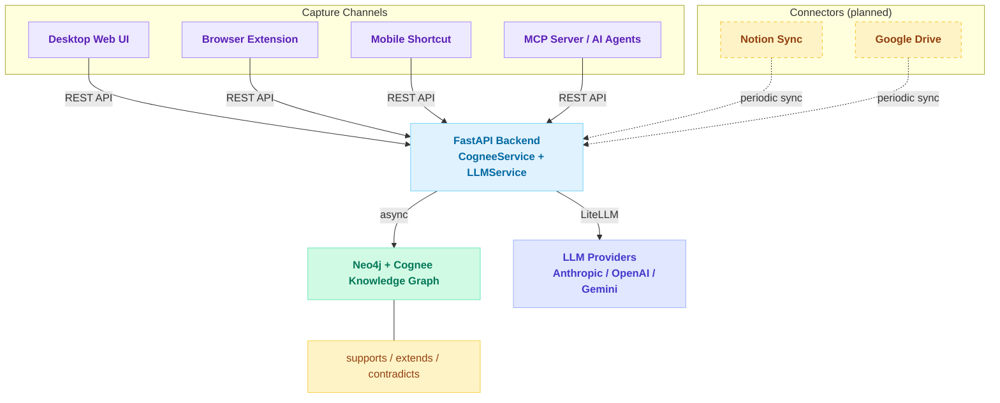

# Zettl

Personal knowledge management system. Captures notes from multiple sources, stores them in a Neo4j knowledge graph with Zettelkasten-style auto-linking via Cognee, and generates weekly content digests in multiple formats.

## How It Works



## Features

- **Note Capture** — Add notes via web UI, browser extension, mobile shortcut, or MCP/AI agents
- **Connectors** (planned) — Periodic sync from Notion and Google Drive
- **Knowledge Graph** — Auto-links notes using Cognee semantic analysis, stored in Neo4j
- **Semantic Search** — Graph-completion and chunk-based search across your knowledge
- **Weekly Digests** — AI-generated summaries of your week's learnings with topic suggestions
- **Content Generation** — Draft content in 4 formats: blog, LinkedIn, X thread, video script
- **Graph Visualization** — Interactive knowledge graph widget on the dashboard
- **User Management** (planned) — Authentication, profiles, and multi-tenant data isolation

## UI

Keyboard-driven dashboard with a command palette (Cmd+K) as primary navigation. No sidebar — maximum content area.

| Page | Purpose |
|------|---------|
| Dashboard (`/`) | Knowledge graph widget, stats, quick actions, activity feed |
| Capture (`/capture`) | Note input with tags and source tracking |
| Search (`/search`) | Semantic and text search with expandable results |
| Digest (`/digest`) | Weekly digest with rendered markdown + Mermaid chart output |

## Quick Start

```bash
cd zettl
cp .env.example .env          # Configure API keys
docker-compose up --build      # Start Neo4j, API, UI
```

- UI: http://localhost:3000
- API: http://localhost:8000
- Neo4j Browser: http://localhost:7474

## Tech Stack

| Layer | Technology |
|-------|-----------|
| Frontend | Next.js, shadcn/ui, Tailwind CSS v4, cmdk |
| Backend | FastAPI, Cognee, LiteLLM |
| Database | Neo4j (knowledge graph) |
| LLM | Anthropic, OpenAI, or Vertex AI via LiteLLM |
| Extension | Chrome Manifest V3 (planned) |

## Docs

- [Knowledge Graph Design](docs/plans/2026-02-04-zettl-knowledge-graph-design.md)
- [Implementation Plan](docs/plans/2026-02-04-zettl-implementation.md)
- [Digest Caching Design](docs/plans/2026-02-18-digest-caching-design.md)
- [UI Design Vision](docs/plans/2026-02-23-ui-design-vision.md)
